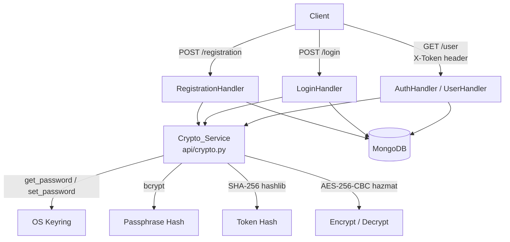

# Design Document: GDPR-Secure Student Registration

## Overview

This design hardens the existing Tornado-based student registration REST API to meet GDPR security
standards. The changes introduce a new `Crypto_Service` module (`api/crypto.py`) that centralises
all cryptographic operations. No existing HTTP contracts, status codes, or response schemas change.

The three pillars of the security upgrade are:

1. **Passphrase hashing** — bcrypt (work factor ≥ 12) replaces plaintext password storage.
2. **Token hashing** — SHA-256 (hashlib) replaces plaintext token storage in MongoDB.
3. **Personal data encryption** — AES-256-CBC (cryptography hazmat primitives) encrypts each
   personal data field independently; IVs are stored in MongoDB alongside the ciphertext; the
   32-byte AES key is managed exclusively through the OS keyring via the `keyring` package.

---

## Architecture



### Module Responsibilities

| Module | Responsibility |
|---|---|
| `api/crypto.py` | All hashing and encryption/decryption; key retrieval from keyring |
| `api/handlers/registration.py` | Call `Crypto_Service` before writing to MongoDB |
| `api/handlers/login.py` | Call `Crypto_Service` for password verification and token hashing |
| `api/handlers/auth.py` | Hash incoming `X-Token` before querying MongoDB |
| `api/handlers/user.py` | Call `Crypto_Service` to decrypt personal data fields before returning |

---

## Components and Interfaces

### Crypto_Service (`api/crypto.py`)

```python
# Key management
def get_encryption_key() -> bytes:
    """Return the 32-byte AES key from the OS keyring, generating it on first use."""

# Passphrase hashing
def hash_passphrase(passphrase: str) -> str:
    """Return a bcrypt hash string (work factor >= 12)."""

def verify_passphrase(passphrase: str, passphrase_hash: str) -> bool:
    """Return True iff passphrase matches passphrase_hash."""

# Token hashing
def hash_token(token: str) -> str:
    """Return the SHA-256 hex digest of token."""

# Personal data encryption / decryption
def encrypt_field(plaintext: str) -> tuple[str, str]:
    """
    Encrypt plaintext with AES-256-CBC.
    Returns (ciphertext_b64, iv_b64).
    """

def decrypt_field(ciphertext_b64: str, iv_b64: str) -> str:
    """
    Decrypt ciphertext_b64 using iv_b64 and the keyring key.
    Returns the original plaintext string.
    """
```

#### Key Management Detail

```python
KEYRING_SERVICE = "gdpr-student-api"
KEYRING_USERNAME = "aes-key"

def get_encryption_key() -> bytes:
    import keyring, os, base64
    stored = keyring.get_password(KEYRING_SERVICE, KEYRING_USERNAME)
    if stored is None:
        raw = os.urandom(32)
        keyring.set_password(KEYRING_SERVICE, KEYRING_USERNAME, base64.b64encode(raw).decode())
        return raw
    return base64.b64decode(stored)
```

#### AES-256-CBC Detail (hazmat primitives)

```python
from cryptography.hazmat.primitives.ciphers import Cipher, algorithms, modes
from cryptography.hazmat.primitives import padding as sym_padding
import os, base64

def encrypt_field(plaintext: str) -> tuple[str, str]:
    key = get_encryption_key()
    iv = os.urandom(16)
    padder = sym_padding.PKCS7(128).padder()
    padded = padder.update(plaintext.encode()) + padder.finalize()
    cipher = Cipher(algorithms.AES(key), modes.CBC(iv))
    enc = cipher.encryptor()
    ciphertext = enc.update(padded) + enc.finalize()
    return base64.b64encode(ciphertext).decode(), base64.b64encode(iv).decode()

def decrypt_field(ciphertext_b64: str, iv_b64: str) -> str:
    key = get_encryption_key()
    iv = base64.b64decode(iv_b64)
    ciphertext = base64.b64decode(ciphertext_b64)
    cipher = Cipher(algorithms.AES(key), modes.CBC(iv))
    dec = cipher.decryptor()
    padded = dec.update(ciphertext) + dec.finalize()
    unpadder = sym_padding.PKCS7(128).unpadder()
    plaintext = unpadder.update(padded) + unpadder.finalize()
    return plaintext.decode()
```

### Handler Changes

#### `registration.py`

- Hash `password` with `hash_passphrase()` before `insert_one`.
- For each present personal data field (`fullName`, `address`, `dateOfBirth`, `phoneNumber`,
  `disabilities`), call `encrypt_field()` and store `{field: ciphertext_b64, f"{field}_iv": iv_b64}`.
- Never write plaintext personal data or plaintext password to MongoDB.
- Response body unchanged: `{email, displayName}`.

#### `login.py`

- Retrieve `password` (now a bcrypt hash) from MongoDB.
- Use `verify_passphrase(supplied_password, stored_hash)` instead of `==` comparison.
- After generating the UUID token, call `hash_token(token)` and store the hash; return the
  plaintext token to the client unchanged.

#### `auth.py` (base handler for authenticated routes)

- Before querying MongoDB, compute `hash_token(token_from_header)` and query on the hash.
- All other logic (expiry check, `current_user` population) is unchanged.

#### `user.py`

- After fetching the user document, iterate over the known personal data fields.
- For each field present in the document, call `decrypt_field(ciphertext_b64, iv_b64)` and include
  the plaintext in the response.
- If a field is absent, omit it silently.
- On decryption failure, respond with HTTP 500.
- `email` and `displayName` are not encrypted (they are used as lookup keys / display values).

---

## Data Models

### MongoDB `users` Collection — Document Schema

```
{
  "email":          string,          // plaintext — used as lookup key
  "password":       string,          // bcrypt hash string (includes embedded salt)
  "displayName":    string,          // plaintext — not a personal data field
  "token":          string | null,   // SHA-256 hex digest of the session token
  "expiresIn":      float | null,    // UTC timestamp (unchanged)

  // Personal data fields — present only when supplied at registration
  "fullName":       string,          // base64-encoded AES-256-CBC ciphertext
  "fullName_iv":    string,          // base64-encoded 16-byte IV
  "address":        string,          // base64-encoded AES-256-CBC ciphertext
  "address_iv":     string,
  "dateOfBirth":    string,          // base64-encoded AES-256-CBC ciphertext
  "dateOfBirth_iv": string,
  "phoneNumber":    string,          // base64-encoded AES-256-CBC ciphertext
  "phoneNumber_iv": string,
  "disabilities":   string,          // base64-encoded AES-256-CBC ciphertext
  "disabilities_iv":string
}
```

**Key invariants:**
- `password` is always a bcrypt hash string; never plaintext.
- `token` is always a SHA-256 hex digest when set; never the raw UUID.
- Every personal data field stored in the document has a corresponding `<field>_iv` entry.
- The AES key is never present in this document.


---

## Correctness Properties

*A property is a characteristic or behavior that should hold true across all valid executions of a
system — essentially, a formal statement about what the system should do. Properties serve as the
bridge between human-readable specifications and machine-verifiable correctness guarantees.*

### Property 1: Passphrase hash round-trip

*For any* non-empty passphrase string, calling `hash_passphrase(p)` to produce a hash and then
calling `verify_passphrase(p, hash)` shall return `True`.

**Validates: Requirements 1.4, 10.7**

---

### Property 2: Stored password is never plaintext

*For any* passphrase used during registration, the value stored in the MongoDB `password` field
shall not equal the original plaintext passphrase string.

**Validates: Requirements 1.2, 10.1**

---

### Property 3: Bcrypt non-determinism

*For any* passphrase string, hashing it twice with `hash_passphrase` shall produce two distinct
hash strings (bcrypt random salt ensures this).

**Validates: Requirements 1.3**

---

### Property 4: Token hash determinism and storage

*For any* UUID hex token string, `hash_token(token)` shall equal
`hashlib.sha256(token.encode()).hexdigest()`, and the value stored in MongoDB after a successful
login shall equal `hash_token(token)` — never the plaintext token.

**Validates: Requirements 3.2, 3.3, 3.4, 10.3, 10.4**

---

### Property 5: Wrong password always rejected

*For any* registered user and *any* password string that does not match the stored bcrypt hash,
the login endpoint shall respond with HTTP 403.

**Validates: Requirements 2.3**

---

### Property 6: Invalid token always rejected

*For any* token string that does not correspond to a stored Token_Hash in MongoDB, an authenticated
request using that token shall receive HTTP 403.

**Validates: Requirements 4.4**

---

### Property 7: Personal data encryption round-trip

*For any* non-empty string used as a personal data field value, calling `encrypt_field(v)` to
obtain `(ciphertext_b64, iv_b64)` and then calling `decrypt_field(ciphertext_b64, iv_b64)` shall
return the original string `v`.

**Validates: Requirements 5.6, 10.6, 10.8**

---

### Property 8: IV is always 16 bytes and unique per encryption call

*For any* two calls to `encrypt_field` (even with identical inputs), the decoded IVs shall each be
exactly 16 bytes, and the two IVs shall differ from each other (independent random generation).

**Validates: Requirements 5.1, 5.3**

---

### Property 9: Personal data stored fields are never plaintext

*For any* personal data field value supplied at registration, the value stored in MongoDB for that
field shall not equal the original plaintext string, and a corresponding `<fieldName>_iv` key shall
be present in the document.

**Validates: Requirements 5.4, 5.5, 7.1, 10.5**

---

### Property 10: User endpoint decrypts personal data correctly

*For any* user registered with personal data fields, a successful `GET /students/api/user` request
shall return each personal data field in plaintext equal to the value originally supplied at
registration.

**Validates: Requirements 6.2, 7.4**

---

### Property 11: Encryption key is always 32 bytes

*For any* call to `get_encryption_key()`, the returned value shall be exactly 32 bytes in length,
suitable for AES-256 operations.

**Validates: Requirements 8.4**

---

## Error Handling

| Scenario | Handler | Response |
|---|---|---|
| Missing or empty `email`/`password` in registration body | `RegistrationHandler` | HTTP 400 |
| Duplicate email at registration | `RegistrationHandler` | HTTP 409 |
| Email not found at login | `LoginHandler` | HTTP 403 |
| Wrong password at login | `LoginHandler` | HTTP 403 |
| Missing `X-Token` header | `AuthHandler` | HTTP 400 |
| Token not found in MongoDB | `AuthHandler` | HTTP 403 |
| Expired token | `AuthHandler` | HTTP 403 |
| Decryption failure for a personal data field | `UserHandler` | HTTP 500 (no partial data) |
| `keyring.get_password` returns `None` (first use) | `Crypto_Service` | Generate and store new key; no error |
| Malformed JSON body | `BaseHandler` | HTTP 400 |

All error responses follow the existing `{"message": "..."}` schema from `BaseHandler.write_error`.

---

## Testing Strategy

### Dual Testing Approach

Both unit tests and property-based tests are required. They are complementary:

- **Unit tests** cover specific examples, integration points, and error conditions.
- **Property-based tests** verify universal correctness across many randomly generated inputs.

### Unit Tests (new files / additions)

**`test/crypto.py`** — tests for `api/crypto.py`:
- `test_hash_passphrase_work_factor` — verify the hash string starts with `$2b$12$`.
- `test_verify_passphrase_correct` — hash then verify returns `True`.
- `test_verify_passphrase_wrong` — verify with wrong password returns `False`.
- `test_hash_token_sha256` — `hash_token(t)` equals `hashlib.sha256(t.encode()).hexdigest()`.
- `test_encrypt_decrypt_roundtrip` — encrypt then decrypt returns original string.
- `test_iv_length` — decoded IV from `encrypt_field` is 16 bytes.
- `test_get_encryption_key_generates_on_first_use` — mock keyring returning `None`; verify 32-byte key returned and `set_password` called.
- `test_get_encryption_key_returns_stored` — mock keyring returning a stored key; verify same key returned.

**`test/registration.py`** (additions):
- `test_password_not_stored_as_plaintext` — after registration, fetch document and assert `doc['password'] != plaintext_password`.
- `test_password_stored_as_bcrypt_hash` — assert `bcrypt.checkpw(plaintext.encode(), doc['password'].encode())` is `True`.
- `test_personal_data_not_stored_as_plaintext` — register with all personal data fields; assert each stored value differs from plaintext.
- `test_personal_data_iv_keys_present` — assert `<fieldName>_iv` keys exist for each supplied field.

**`test/login.py`** (additions):
- `test_token_not_stored_as_plaintext` — after login, fetch document and assert `doc['token'] != response_token`.
- `test_token_stored_as_sha256` — assert `doc['token'] == hashlib.sha256(response_token.encode()).hexdigest()`.

**`test/user.py`** (additions):
- `test_user_personal_data_decrypted` — register with personal data, login, call `/user`, assert plaintext values returned.
- `test_user_missing_field_omitted` — register without optional fields; assert those keys absent from response.

### Property-Based Tests (`test/property_tests.py`)

Uses **Hypothesis** (already compatible with the Python/pytest stack; add `hypothesis` to `requirements.txt`).

Each property test runs a minimum of **100 iterations** (Hypothesis default is 100; set
`@settings(max_examples=100)` explicitly).

Tag format in comments: `# Feature: gdpr-secure-student-registration, Property N: <property_text>`

```python
from hypothesis import given, settings
from hypothesis import strategies as st

# Feature: gdpr-secure-student-registration, Property 1: Passphrase hash round-trip
@given(st.text(min_size=1))
@settings(max_examples=100)
def test_passphrase_hash_roundtrip(passphrase):
    h = hash_passphrase(passphrase)
    assert verify_passphrase(passphrase, h) is True

# Feature: gdpr-secure-student-registration, Property 3: Bcrypt non-determinism
@given(st.text(min_size=1))
@settings(max_examples=100)
def test_passphrase_hash_nondeterministic(passphrase):
    assert hash_passphrase(passphrase) != hash_passphrase(passphrase)

# Feature: gdpr-secure-student-registration, Property 4: Token hash determinism
@given(st.text(min_size=1))
@settings(max_examples=100)
def test_token_hash_deterministic(token):
    assert hash_token(token) == hash_token(token)
    assert hash_token(token) == hashlib.sha256(token.encode()).hexdigest()

# Feature: gdpr-secure-student-registration, Property 7: Personal data encryption round-trip
@given(st.text(min_size=1))
@settings(max_examples=100)
def test_encrypt_decrypt_roundtrip(value):
    ct, iv = encrypt_field(value)
    assert decrypt_field(ct, iv) == value

# Feature: gdpr-secure-student-registration, Property 8: IV is 16 bytes and unique
@given(st.text(min_size=1))
@settings(max_examples=100)
def test_iv_16_bytes_and_unique(value):
    _, iv1 = encrypt_field(value)
    _, iv2 = encrypt_field(value)
    assert len(base64.b64decode(iv1)) == 16
    assert len(base64.b64decode(iv2)) == 16
    assert iv1 != iv2

# Feature: gdpr-secure-student-registration, Property 11: Encryption key is 32 bytes
@settings(max_examples=100)
def test_encryption_key_32_bytes():
    # Run 100 times with mocked keyring to cover both generate and retrieve paths
    key = get_encryption_key()
    assert len(key) == 32
```

### Test Configuration Notes

- Property tests are in `test/property_tests.py` and discovered by `run_test.py` via `unittest` loader.
- Hypothesis integrates with `unittest.TestCase` via `@given` on test methods.
- Each property-based test is tagged with the design property it validates.
- The existing test files (`test/registration.py`, `test/login.py`, `test/user.py`) are extended
  with new test methods; no existing test methods are modified.
- `test/login.py` and `test/user.py` setUp methods must be updated to use bcrypt-hashed passwords
  and SHA-256 token hashes when seeding the database directly, so that the existing tests continue
  to pass against the updated handlers.
